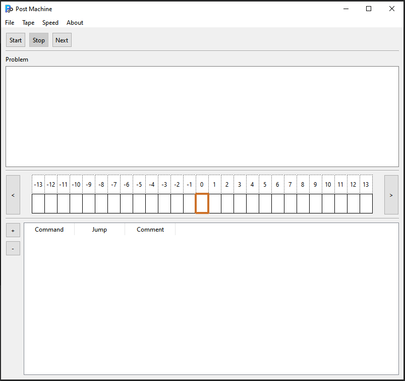

# Emil Post Machine Simulation Program

## Overview

This project is a Post Machine simulation program written in C++ using the Qt library. The program is designed to simulate the operation of a Post Machine, a theoretical computational model proposed by Emil Post in the 1930s. It is distributed under the terms of the GNU General Public License, version 3 (GPL-3.0).

## Table of Contents

- [Overview](#overview)
- [Features](#features)
- [Screenshots](#screenshots)
- [Getting Started](#getting-started)
- [Prerequisites](#prerequisites)
- [Building](#building)
- [Running](#running)
- [Usage](#usage)
- [License](#license)

## Features

- Simulate the behavior of a Post Machine.
- Define and edit custom Post Machine configurations.
- Step through the execution of a Post Machine.
- Visualize the state transitions and tape modifications.
- Export and import Post Machine configurations for sharing and collaboration.

## Screenshots



## Getting Started

### Prerequisites

Before you can build and run the Post Machine simulation program, you will need to have the following prerequisites installed on your system:

- C++ compiler that supports C++17 or later.
- Qt development libraries (Qt 6 or later).
- CMake (version 3.30 or later).

### Building

Follow these steps to build the Post Machine simulation program:

1. Clone the repository to your local machine:

   ```bash
   git clone https://github.com/adidvar/post-machine.git
   ```

2. Change to the project directory:

   ```bash
   cd post-machine 
   ```

3. Create a build directory:

   ```bash
   mkdir build
   cd build
   ```

4. Generate the build files using CMake:

   ```bash
   cmake -S ..
   ```

5. Build and install the program:

   ```bash
   cmake --build .
   cmake --install .
   ```

### Running

Once the program is built successfully, you can run it using the following command:

```bash
./PostMachine
```

## Usage
1. Use GUI to setting up Post Machine. 
2. Run Post Machine and watch how it work. 
3. Export and import Post Machine configurations using the provided options.

## License

This project is licensed under the GNU General Public License, version 3 (GPL-3.0). See the [LICENSE](LICENSE) file for details.
